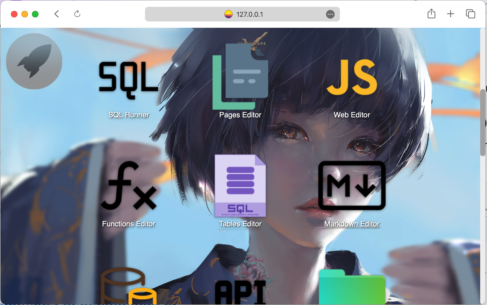
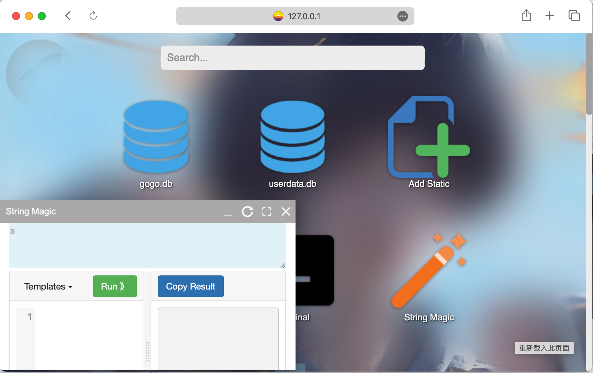
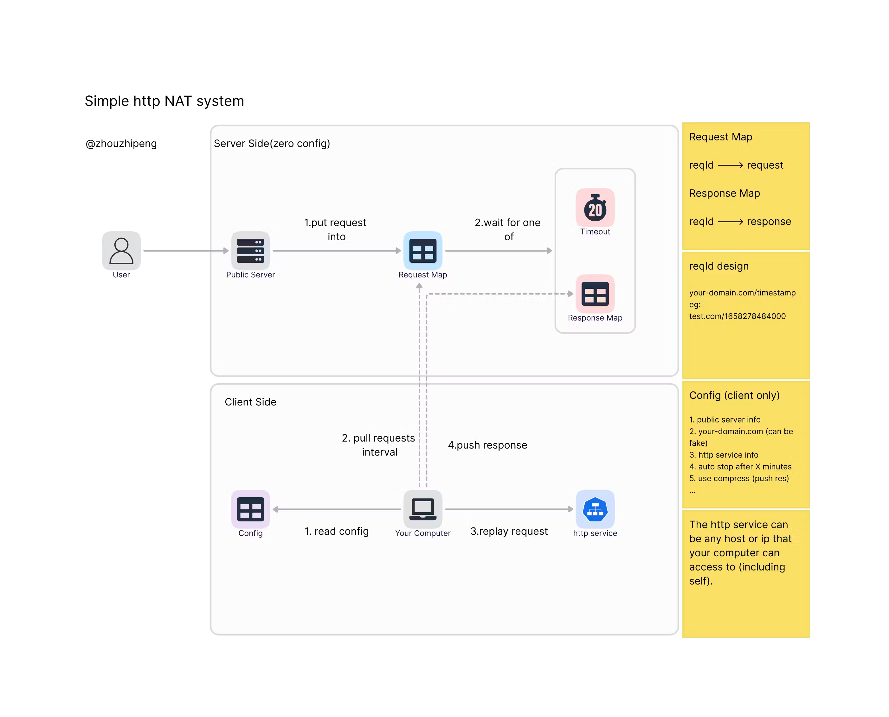

# codebox
This is a tool box for programmers. 




currently tools:
* sqlite db browser
* functions editor
* tables editor
* pages editor
* string template 
* sql runner


# features
## web server (python)
support write python functions and sql opereations and pages on the fly.

## NAT (Reverse Proxy)
will reverse proxy for local services, domain should like 'xx.proxy.xx'



## Trojan server / client
will use port 443

## Http/s Server (with autocert)
also support websocket using path /ws

## Mail receiving server
(START_MAIL_SERVER=true)
listen for port 25 and insert emails into table 'email_inbox' (userdata.db)

## Common Proxy  Pass(using DNS txt record)
1. add a A record to codebox server
2. add a TXT record like '127.0.0.1:8080' for a domain
   (need to restart server if old TXT records changing)

## http git server
only git is needed to install in the machine where gogo server is , and no ui , no need to create repo first , just push & pull.
use like this : ` http://{gogo_server_ip}:{gogo_server_http_port}/git/{your_repo}.git`

## websocket
### 1. Connect
wss://{{your server domain}}/ws

### 2. Data structure
{
"From":"{your unique id}",
"To":"{msg to whom,keep empty if broadcast}",
"Data":"{use the whole json template to send or receive messages}"
}

## Port forwarding
1. set PORT_FORWARDING_ENABLE=true in init config.
   support port forwarding from a range of ports to another local port.

## debian install
Currently support Debian bullseye (11)
```bash
curl -sSL https://raw.githubusercontent.com/zhouzhipeng/codebox/master/scripts/install_codebox_on_debian11.sh | sudo bash
```

## docker image
```bash
docker pull zhouzhipeng/codebox:latest
```

## fetch
```javascript
let data = new URLSearchParams();
data.append("id", note.id);
data.append("note",note.text);
data.append("timestamp", note.timestamp);
data.append("left",note.left);
data.append("top", note.top);
data.append("zindex", note.zIndex);
fetch('/tables/WebKitStickyNotes/update', {method: "POST",headers: {'Content-Type': 'application/x-www-form-urlencoded; charset=UTF-8'}, body: data})

```


## trojan protocol:  
https://trojan-gfw.github.io/trojan/protocol.html


## local dev
start golang module: go build codebox, then start web.py  (pip install -r requirements.txt)

## mail server (receive only)
[see doc](https://notes.eatonphil.com/handling-email-from-gmail-smtp-protocol-basics.html)
https://github.com/kirabou/parseMIMEemail.go

